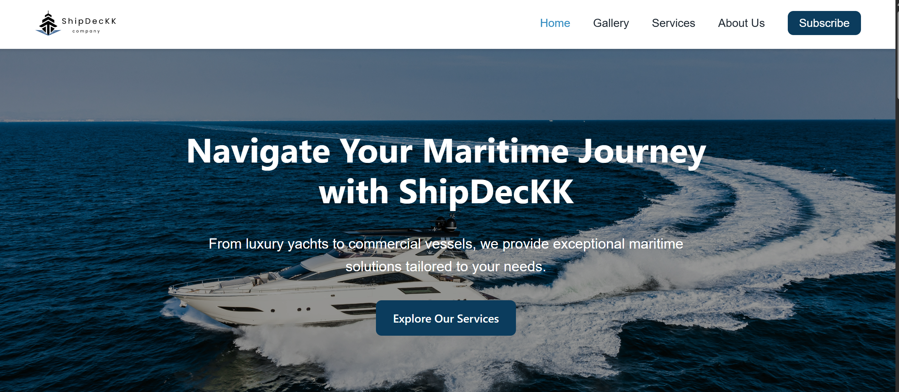

# Ship-Dealer-Company-Website
A responsive, user-friendly website prototype for a ship dealership business. Built with HTML, CSS, and vanilla JS to ensure cross-device usability and accessibility.

## Preview
🔗 **Live Demo** → [https://shipdeckkbyfel.netlify.app](https://shipdeckkbyfel.netlify.app)  

## Project Overview
ShipDecKK is a front-end web project simulating a professional ship dealer’s online presence. The site includes:
- **Home Page** with branding and call-to-action
- **About Section** explaining the dealership’s background
- **Services Overview** for ship sales, maintenance, and custom orders
- **Gallery** showcasing ship categories such as yachts, cargo vessels, and speedboats
- **Contact Form & Subscription** for lead capture and customer engagement

This project demonstrates skills in **HTML, CSS, JavaScript**, and **Human-Computer Interaction** principles to deliver a smooth user experience.

## Features
- Fully responsive design — adapts to desktop, tablet, and mobile
- Interactive gallery filtering — easily browse by ship type
- Smooth scroll navigation for better accessibility
- Contact & subscription form with basic validation
- Hover and transition effects to enhance interactivity

## Tech Stack ⚙️
- **HTML5** — semantic, accessible structure
- **CSS3** — responsive layouts with media queries and animations
- **JavaScript (ES6)** — interactive features and form handling
